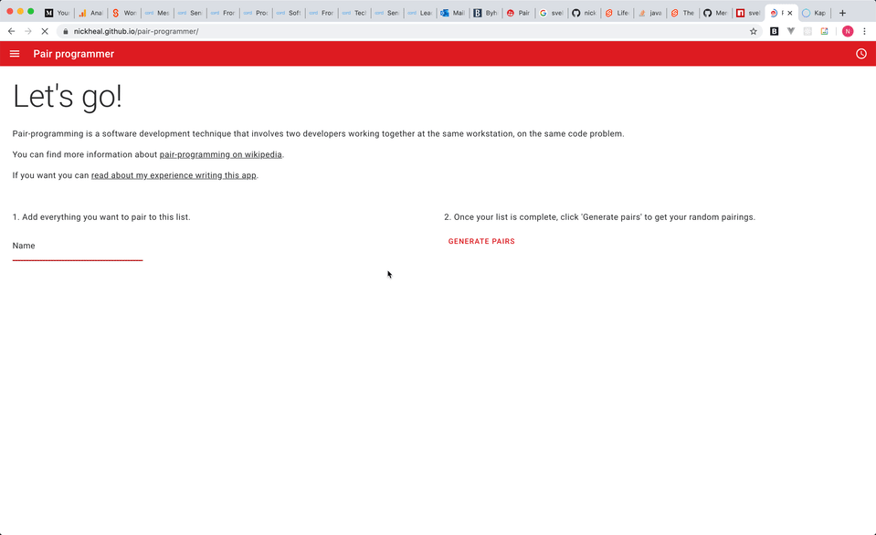

# svelte-tour



svelte-tour components to create an interactive tour.

## Quick start

1. Somewhere in your application—most likely at a high level near the entry-point—you need to include the `Tour` component. This handles showing the tour when it is run.
```HTML
<script>
  import { Tour } from 'svelte-tour';
</script>

<main>
  <slot></slot>
  <Tour></Tour>
</main>
```

2. Any item you want to include in the tour needs to be wrapped with the `TourItem` component. Include a message property to define the text to show in the tour tip.
```HTML
<script>
  import { TourItem } from 'svelte-tour';
</script>

<main>
  <TourItem message="This is a button I want to include in the tour.">
    <button>Click here</button>
  </TourItem>
</main>
```

3. Call `run` to start the tour. It will tour you through all `TourItem`s currently in the page.
```HTML
<script>
  import { onMount } from 'svelte';
  import { run } from 'svelte-tour';

  onMount(run);
</script>

<main>
  <slot></slot>
  <Tour></Tour>
</main>
```

## Options

Optionally you can include a `TourTip` component to handle the rendering of the content in the tour.
```HTML
<script>
  import { Tour } from 'svelte-tour';
  import TourTip from 'my-tourtip-component';
</script>

<main>
  <slot></slot>
  <Tour {TourTip}></Tour>
</main>
```

Your `TourTip` will receive three parameters.
```javascript
export let atEnd; // boolean - are we on the last item in the tour?
export let message; // string - the message for this step of the tour.
export let onClickNext; // func - function to trigger a move to the next step.
```
